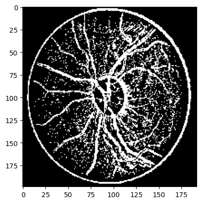

# Retinal Image Segmentation Using SVM Classifier

## Project Description

This project focuses on the segmentation of retinal images and segmenting out the retinal veins. The primary objective of this project is to develop a robust segmentation model that can accurately segment the veins of the retina, which is critical for diagnosing and monitoring various ocular diseases.

The project employs a Support Vector Machine (SVM) classifier to achieve pixel-wise classification, segmenting the retinal images into distinct classes such vein and background. The effectiveness of the model is evaluated using standard performance metrics.

## Project Objective

- **Goal:** To accurately segment retinal images into veins and backround (Binary Classification) using an SVM classifier.
- **Applications:** This segmentation can assist in the diagnosis and monitoring of various diseases.
- **Scope:** The project is focused on binary classification for segmentation purposes, and the trained model can be extended for multiclass segmentation with further modifications.

## Dataset

- **Dataset Used:** [Retinal Image Dataset](https://link-to-dataset)
  - The dataset consists of high-resolution retinal images, including annotations for the retinal veins.
  - The images have been preprocessed to ensure uniformity in size and resolution.

## Classifier Used

- **Support Vector Machine (SVM) Classifier:** [Learn more about SVM](https://scikit-learn.org/stable/modules/svm.html)
  - **Kernel:** Radial Basis Function (RBF)
  - **Feature Extraction:** Filters from sklearn 
  - **Dimensionality Reduction:** Principal Component Analysis (PCA)
  - The SVM classifier has been trained to classify each pixel into one of the predefined classes based on the extracted features.

## Results

The table below summarizes the performance of the SVM classifier on the test dataset:

| Metric              | Value  |
|---------------------|--------|
| **Accuracy**        | 83.2%  |
| **Precision**       |        |
| **Recall**          |        |
| **F1-Score**        |        |
| **Dice Coefficient**|        |
| **Jaccard Index**   |        |



## Model Checkpoint

You can download the trained SVM model checkpoint using the link below:

- [Download Model Checkpoint](Trained_model_checkpoints)

## Demo Notebook

A Jupyter notebook demonstrating the model's usage, including loading the checkpoint, running predictions on sample images, and visualizing the results, is available:

- [Demo Notebook](TEST_SCRIPT.ipynb)

## Getting Started

### Prerequisites

Ensure you have the following dependencies installed:

- Python 3.8+
- scikit-learn
- numpy
- pandas
- matplotlib
- OpenCV
- Jupyter Notebook

### Running the demo
``` bash 
jupyter notebook TEST_SCRIPT.ipynb
```

### Contact Me 

For any questions, feedback, or collaboration requests, feel free to reach out:

-Email: ritwik21485@iiitd.ac.in
